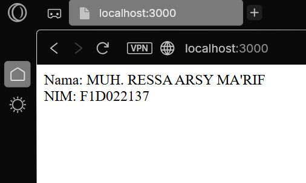
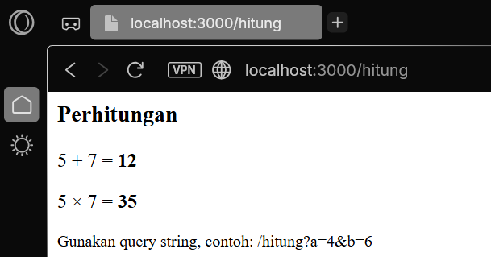
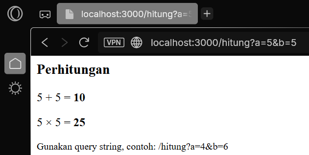
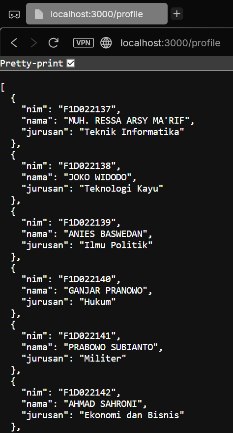
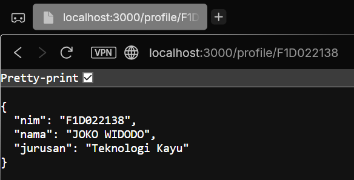

# Week 6 - Express.js & Modul Node.js

## Identitas
- **Nama** : MUH. RESSA ARSY MA'RIF
- **NIM**  : F1D022137

---

## Deskripsi Tugas
Tugas ini bertujuan untuk memahami dasar penggunaan **Express.js** dan **modul lokal Node.js** dengan cara membuat server sederhana dan memanfaatkan route modular.  

Fitur yang diimplementasikan:
1. Route `/` → menampilkan Nama dan NIM.
2. Route `/hitung` → menampilkan hasil penjumlahan dan perkalian dari fungsi `tambah()` dan `kali()` pada `math.js`.
3. Route `/profile` → menampilkan daftar profil berupa array JSON.
4. Route `/profile/:nim` → menampilkan detail profil berdasarkan NIM tertentu.

---

## Implementasi

### 1. Route `/`
- **Tujuan**: Menampilkan identitas (Nama & NIM).  
- **Screenshot**:  
  

### 2. Route `/hitung`
- **Tujuan**: Menampilkan hasil penjumlahan dan perkalian angka.  
- **Screenshot (default)**:  
    
- **Screenshot (custum)**:  
  

### 3. Route `/profile`
- **Tujuan**: Menampilkan daftar beberapa profil dalam format JSON.  
- **Screenshot**:  
  

### 4. Route `/profile/:nim`
- **Tujuan**: Menampilkan detail profil berdasarkan NIM tertentu.  
- **Screenshot**:  
  

---

## Kesimpulan
- **Express.js** memudahkan pembuatan server web dengan sistem routing yang sederhana dan fleksibel.  
- Modularisasi dengan `utils/math.js` (fungsi tambah & kali) dan `routes/profile.js` (route profile) membuat kode lebih **rapi** dan **mudah dikelola**.  
- Route `/hitung` berhasil menampilkan hasil **penjumlahan & perkalian** baik default maupun dengan query string.  
- Route `/profile` dan `/profile/:nim` berhasil menampilkan data JSON, baik daftar semua profil maupun detail berdasarkan NIM.  
- Dengan struktur modular ini, aplikasi lebih mudah dikembangkan dan diperluas untuk kebutuhan lain.  
